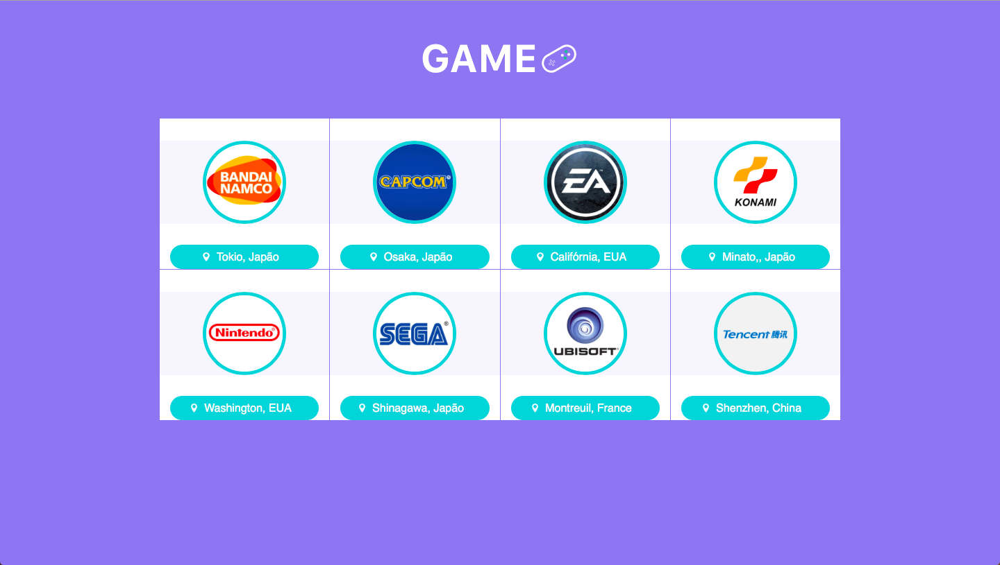
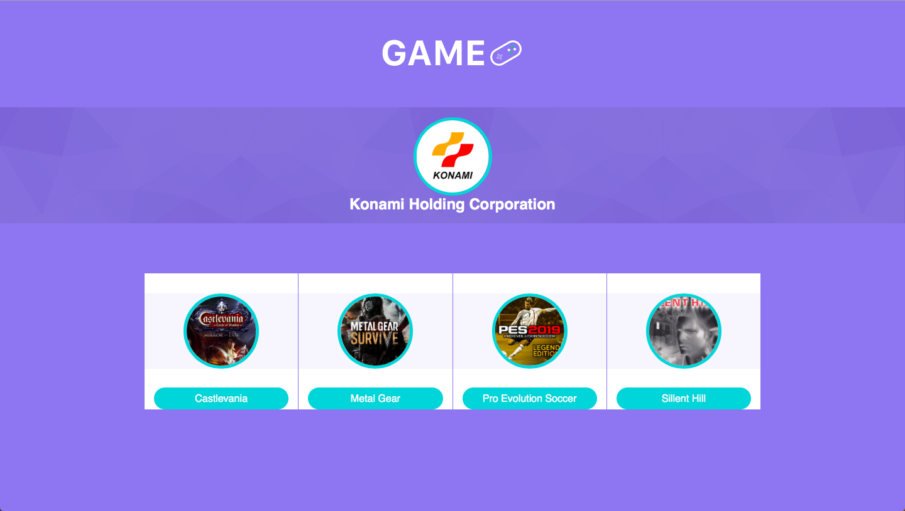

# Game-Web
Interface web criada com React e ReactJS para consumir a WebAPI Game-API.

## Tecnologias e Conceitos
* React e ReactJS
* Navigation (react-router-dom)
* Hooks
* Axios

## Sobre aplicação

Basicamente a aplicação busca explorar a nova api Hook do React, o consumo de serviço rest com axios e sistema de rotas.

*[Confira a aplicação](http://lab.yeza.com.br/gameweb/)*

## Resultado

#### *Home* ####

#### *Tela de detalhe* ####

